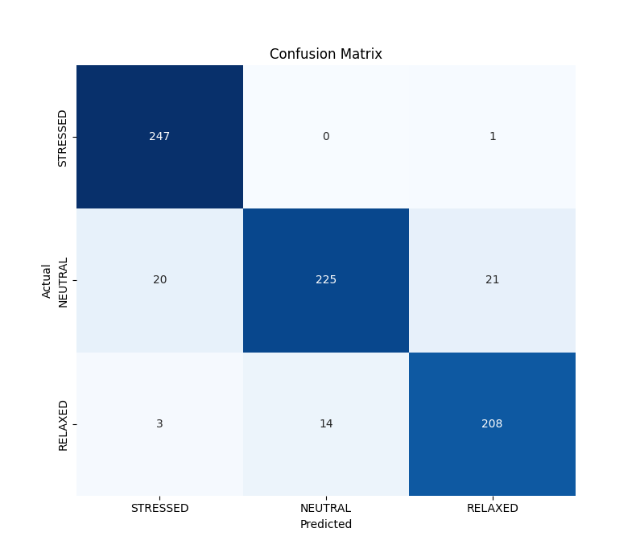
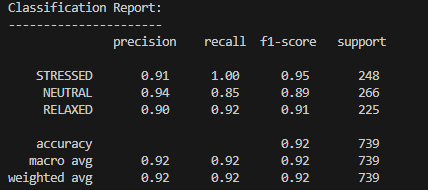
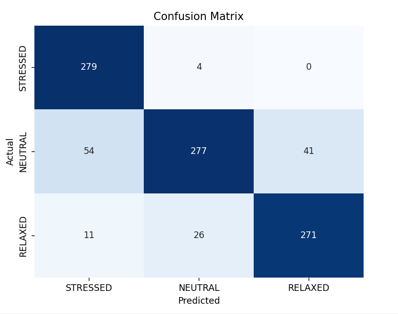
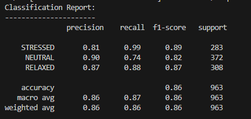
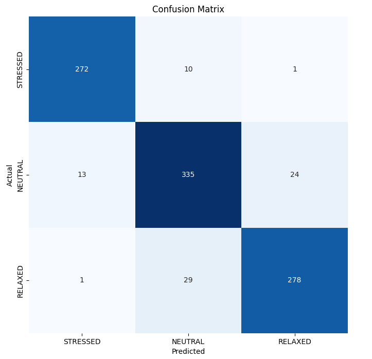
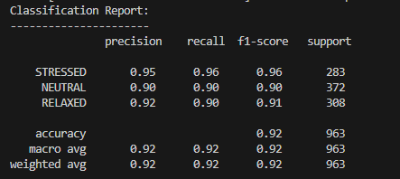
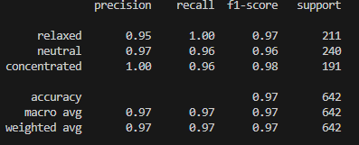
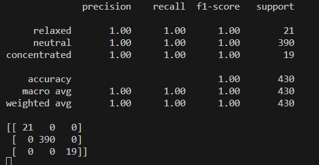
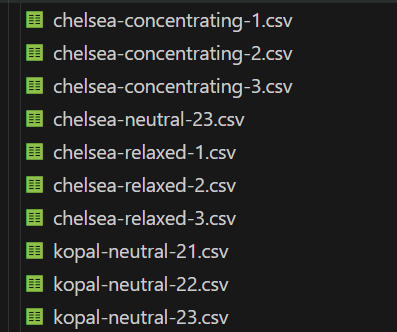
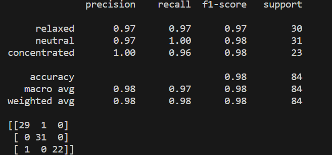

## Results:

In this file, we will keep track of the different test runs we've done and their results.
Notes:

- GRU Model - Refers to the model Elizabeth developed during Milestone 1
- XGBClassifer - Refers to the model Niteesh developed during Milestone 1
- Dr. Bird's data - Refers to the data collected by Dr. Bird located [here](https://github.com/jordan-bird/eeg-feature-generation/tree/master/dataset/original_data).
- Tim's data - Refers to the data collected by Tim de Boer located [here](https://github.com/Timm877/BCI_Project/tree/main/datasets/mental_states).

## Testing:

Note: I only included test results prior the GRU model bug fix.

## Elizabeth - 10/02/2023

- Dataset: Dr. Bird's
- Epochs: 5
- Model: GRU
- Output:
  - Test Accuracy rate: 92.01%
  - 
  - 

## Elizabeth - 10/02/2023

- Dataset: Dr. Bird's and Tim's
- Epochs: 5
- Model: GRU
- Output:
  - Test Accuracy rate: 85.87%
  - 
  - 

## Elizabeth - 10/09/2023

- Dataset: Dr. Bird's and Tim's
- Epochs: 10
- Model: GRU
- Output:
  - Test Accuracy rate: 91.90%
  - 
  - 

## Elizabeth - 10/11/2023

- Dataset: Dr. Bird's and Tim's
- Model: XGB
- Parameters:
     'objective':'multi:softprob',
     'max_depth': 6, 
     'n_estimators':100,
     'colsample_bylevel':0.5,
     'colsample_bytree':0.6,
     'learning_rate':0.2,
     'random_state':20,
     'alpha':10,
     'lambda':8
- Output:
  - Test Accuracy rate: 97.19%
  - 

## Elizabeth - 10/15/2023

- Dataset: Dr. Bird's and our data (Dr. Bird's data was used for the concentrating and relaxed states, while ours was used for the neutral state)
- Data used:
  - chelsea-neutral-23
  - kopal-neutral-21
  - kopal-neutral-22
  - kopal-neutral-23
  - subjecta-concentrating-1
  - subjectb-relaxed-1
- Model: XGB
- Parameters:
     'objective':'multi:softprob',
     'max_depth': 6, 
     'n_estimators':100,
     'colsample_bylevel':0.5,
     'colsample_bytree':0.6,
     'learning_rate':0.2,
     'random_state':20,
     'alpha':10,
     'lambda':8
- Output:
  - Test Accuracy rate: 100%
  - 

## Elizabeth - 10/20/2023

- Dataset: Our data for all 3 states
- Data used:

- Model: XGB
- Parameters:
     'objective':'multi:softprob',
     'max_depth': 6, 
     'n_estimators':100,
     'colsample_bylevel':0.5,
     'colsample_bytree':0.6,
     'learning_rate':0.2,
     'random_state':20,
     'alpha':10,
     'lambda':8
- Output:
  - Test Accuracy rate: 97.61%
  - 
